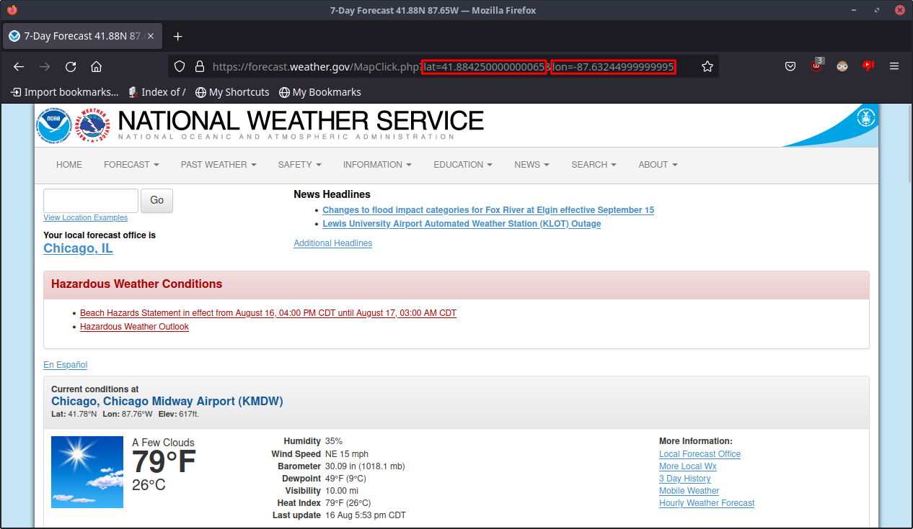
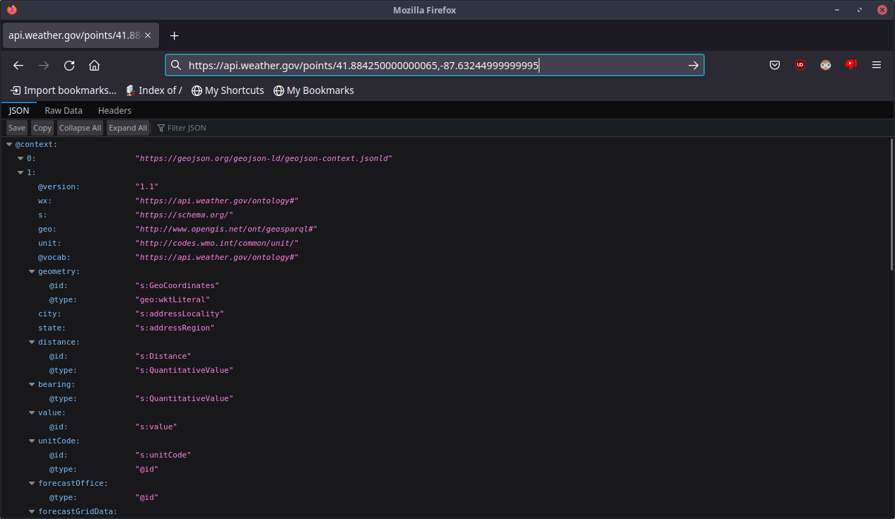
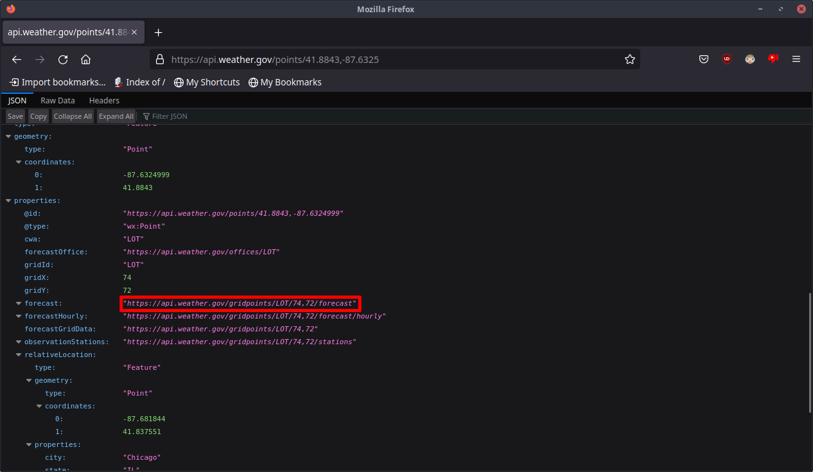
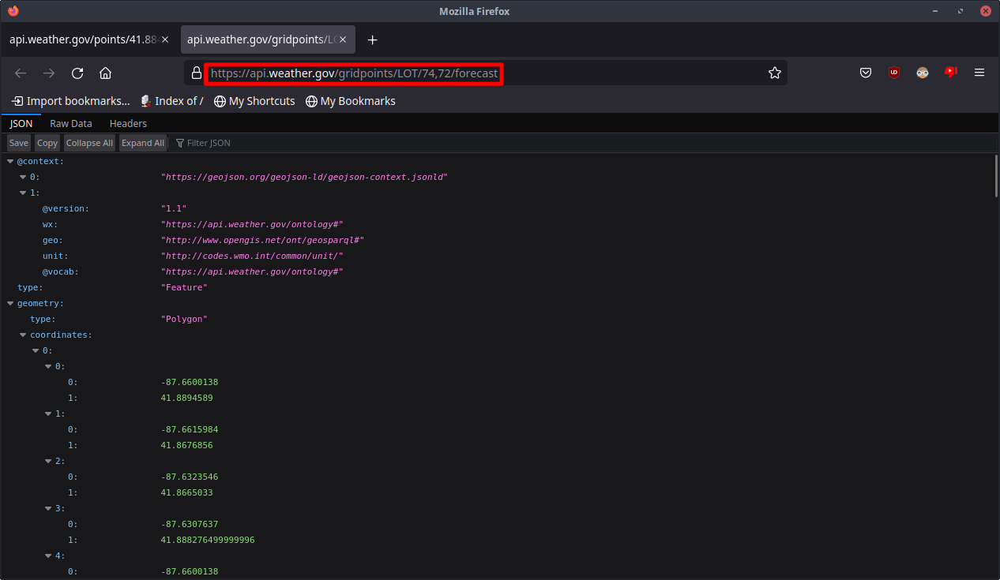

# Weather-Displayer
Displays the Weather from the National Weather Service API

```
                      ,
                      :
         '.        _______       .'
           '  _.-"`       `"-._ '
            .'                 '.
     `'--. /                     \ .--'`
          /                       \
      '   |                       |  '-.
         Sunny
Current Temperature: 79, Tonight's Temperature:
57, Wednesday's Temperature: 81
The wind: E at 10 mph.
```

## My Usecase
I'm making this to replace my Accu-Rite Weather station that broke. This will be run on a Raspberry Pi and Raspberry Pi Touchscreen

## Description of the Scripts

### main.py
The main part of the script that interprets data from the NWS API and displays it on the screen

### getter.py
In charge of getting the data from the NWS API and giving it to main.py.

### manager.sh
Shell script to execute everything as needed. You can also quit the script from manager.sh by passing the ```-q``` argument.

## Installation

### Windows
First off, this script was designed for use on Linux, specifically for the Raspberry Pi. If you wish to run it on Windows, you can clone this repo and 
build your own batch script. Just make sure the getter script is executed first, in a seperate thread.

You will then need to download Python 3 if you haven't already. Head over to [the Python Project's Website](https://www.python.org/) and download the 
latest version of Python 3. 

After this, you need to download a program called "cowsay". After downloading Python, you can do this from the Pip package manager. After ensuring Pip is 
in your PATH environment variable, you can run ```pip install cowsay``` in an **Administrative** command line.

### MacOS
I am not familiar with MacOS, nor do I have a Mac to test this on. Basically install Python and Cowsay, then download the project.

### Linux
Not much setup should be needed on Linux, the vast majority of distros already have Python installed. But if you don't, run:

Debian: ```sudo apt install python```

Ubuntu: ```sudo apt install python3```

Red Hat/Fedora: ```sudo dnf install python3```

Arch (as root): ```pacman -S python```


You will also need to install a program called "cowsay". This most likely isn't installed on your distribution.

Debian/Ubuntu: ```sudo apt install cowsay```

Red Hat/Fedora: ```sudo dnf install cowsay```

Arch (as root): ```pacman -S cowsay```

From here, simply clone this repository, either with the above "Code" drop-down or with ```git clone "https://github.com/JR-Tech-and-Software/Weather-Displayer/Weather-Displayer.git"```

### All
After Python is installed and the project has been downloaded, you will need to tell the script the URL to get your local weather data. It can take 
multiple steps to do this. I'll be using Chicago, IL as my example here.

1. Head to [the National Weather Service's Webpage](https://www.weather.gov/)
2. In the local forecast search box at the top, type in your city and state abbreviation, seperated by a comma. A drop down will come up, click the 
option best fit for you.

3. In the URL bar, you should see Latitude and Longitude values for your city. Copy these somewhere, we'll need them later.

4. You can now use this data to find your NWS API URL. This within itself will take a few steps.
   1. You will need to assemble a URL with your Latitude and Longitude. The format will be like this: ```https://api.weather.gov/points/<LAT>,<LONG>```.
   In my example, it is ```https://api.weather.gov/points/41.8843,-87.6325```
   
   2. Go to this URL and find the "forecast" element in the JSON. This contains the URL we ultimately need. In my example, that URL is ```https://api.weather.gov/gridpoints/LOT/74,72/forecast```
   
   3. This is the URL we need to give the program. Open this URL up in a new tab to ensure it works. You should see something similar to me here:
   
5. Put the URL in a file called ```url```. Be sure there is no file extensions, especially if you are running Windows. This file sould be in the same directory as the other Python files.
6. You are ready to go! Run the ```manager.sh``` script and see your weather data!

# License
This program is under the GNU General Public License v3. Be sure to check out the [LICENSE file](LICENSE) for more info.
